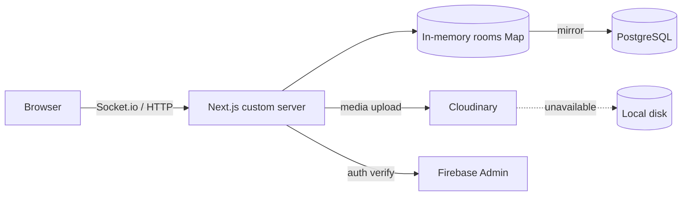

# oob

> Real-time media collaboration board. Create a room, share the 8-character key, and everyone in it can upload videos, photos, and audio, drag them around a freeform canvas, chat, and watch everything update live — no account required.


**Live demo:** [oob-13cm.onrender.com](https://oob-13cm.onrender.com/)

---

## Why this project exists

Most "collaboration" apps force everyone through signups, accounts, and setup before you can do anything. I wanted the opposite: **one key, no friction** — the way a physical whiteboard already works. You hand someone an 8-character key and a shared media board appears for everyone. The result is an architecture that has to *gracefully degrade* and stay *responsive under continuous event traffic* — which is where most of the interesting engineering lives.

## What it does

- **Room-based collaboration** — an 8-character key is all you need to join; no account unless Google sign-in is enabled
- **Live media board** — images, videos, and audio dropped on a freeform canvas; drag to reposition and everyone sees it move in real time
- **Synced playback** — play, pause, or seek a video/audio card and the whole room follows along (last-action-wins)
- **Built-in chat** — lightweight room chat, no separate service; messages capped at 2000 chars server-side
- **Paste-to-upload** — copy an image anywhere and paste it straight onto the board
- **Optional Google sign-in** — real identities via Firebase (verified server-side when configured), anonymous names otherwise
- **Graceful degradation** — runs perfectly with zero configuration

## Architecture

Fast, in-memory rooms are the real-time source of truth; PostgreSQL mirrors them only for durability and hops in when state is lost.



**Flow:** browser → Next.js custom server (Socket.io) → room state broadcast live in-memory → mirrored to Postgres → media pushed to Cloudinary with disk fallback.

## Key technical decisions

The parts of this project I'm most proud of, because each one handled a problem that actually needed solving:

### 1. In-memory rooms + Postgres mirror (two-tier state)
Live rooms live in a `Map` — reads and broadcasts never touch a database, so dragging and chat stay fast under sustained traffic. Postgres is a **mirror, not the source**. On join, missing rooms hydrate from the DB; on every mutation, state persists asynchronously. When Postgres is absent, the app silently degrades to in-memory-only.

### 2. Throttled position writes
A drag fires a position update per animation frame — writing every one to Postgres would flood the DB. Positions are debounced to **≤1 write/sec per media item** (`server.js:38-46`) while the broadcast stays real-time. The atomic unit of engineering here: *hot path stays hot, cold path stays cheap.*

### 3. Graceful degradation everywhere
Everything optional is a feature of the design, not a shortcut:
- **Cloudinary → local disk**: if the upload API fails (bad creds, rate-limit, network), the file still lands on disk instead of erroring out (`server.js:99-107`)
- **Postgres → in-memory**: no `DATABASE_URL`, rooms don't survive restarts — otherwise identical behavior
- **Firebase → trust-client**: no Admin creds, anonymous identities with a warning, never crashes

### 4. Server-side security that doesn't trust the client
- Uploads capped at **50 MB decoded / 70 MB raw base64** and rejected immediately (`413`) — the buffer is destroyed on breach, not buffered
- Filenames **sanitized** (`#`, `?`, emoji, spaces stripped) because a `#` in a name breaks `<video>`/`` URLs as a fragment delimiter (`server.js:85-89`)
- Socket payloads validated before use; media objects missing `id`/`url` are dropped
- **Server-verified identity**: with Firebase Admin configured, the verified uid/name/photo *overwrite* whatever the client sends — spoofing is impossible (`server.js:190-202`)
- Position coords clamped to `0–100`; chat truncated server-side

### 5. Runtime uploads served safely
In production, Next.js only serves `public/` assets that existed at *build time* — runtime uploads would otherwise 404. The custom server explicitly serves `/uploads/*` with the right content-type and `path.basename` to kill any path-traversal attempt (`server.js:139-150`).

## Run locally

Requirements: **Node 20+**

```bash
git clone <repo-url> oob
cd oob
npm install
npm run dev
```

Open **http://localhost:3000**. Zero env vars needed — copy `.env.example` to `.env.local` and fill in only what you want to unlock.

Production build: `npm run build && npm start`.

## Configuration

| Env var | Required | Description |
|---|---|---|
| `CLOUDINARY_CLOUD_NAME` / `CLOUDINARY_API_KEY` / `CLOUDINARY_API_SECRET` | — | Media storage in Cloudinary. Unset = files go to local disk |
| `DATABASE_URL` | — | PostgreSQL: rooms + media survive restarts. Unset = in-memory |
| `DATABASE_SSL` | — | `"true"` when your Postgres connection requires SSL |
| `NEXT_PUBLIC_FIREBASE_*` | — | Enables Google sign-in (browser config) |
| `FIREBASE_PROJECT_ID` / `FIREBASE_CLIENT_EMAIL` / `FIREBASE_PRIVATE_KEY` | — | Server-side Google ID token verification (recommended for production) |

## Project structure

```
├── server.js            # Custom Next.js server: Socket.io, uploads, static serving
├── db.js                # PostgreSQL layer — graceful no-op when unconfigured
├── cloudinary.js        # Media storage adapter with disk fallback
├── firebaseAdmin.js     # Server-side Firebase ID token verification
└── src/app/
    ├── page.tsx         # Create / join a room
    ├── board/[key]/     # Live board, chat, user list
    └── providers/       # Socket and Auth React providers
```

---

Made with the belief that collaboration shouldn't require an account.

---

<div align="left">
  <font face="Aref Ruqaa" size="5">فیروز خان چوہان</font>
</div>