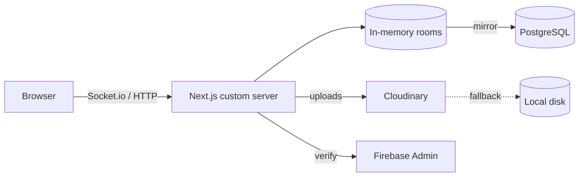

# oob

Real-time media collaboration board — share an 8-character key, everyone uploads, drags, chats, and watches together. No account required.

**Live demo:** [oob-13cm.onrender.com](https://oob-13cm.onrender.com/)


## Install

```bash
git clone <repo-url> oob && cd oob
npm install
npm run dev        # http://localhost:3000 — zero env vars needed
```

## Usage

1. Open the app → **Create room** → share the 8-character key
2. Drop videos, photos, audio onto the canvas — drag to reposition, everyone sees it live
3. Play/pause/seek a media card and the whole room follows (last-action-wins)
4. Chat in the sidebar; paste an image anywhere to upload it

## Features

- Room-based, key-only access — anonymous names, or real Google sign-in when Firebase is configured
- Runs perfectly with zero configuration; every integration is optional and degrades gracefully
- Uploads capped at 50 MB, filenames sanitized, payloads validated server-side

## Environment Variables

All optional — copy `.env.example` to `.env.local` and fill only what you want to unlock:

```bash
DATABASE_URL=              # rooms + media survive restarts (else in-memory)
CLOUDINARY_CLOUD_NAME=     # + API_KEY + API_SECRET — cloud media (else local disk)
NEXT_PUBLIC_FIREBASE_API_KEY=  # + AUTH_DOMAIN + PROJECT_ID — Google sign-in
FIREBASE_PRIVATE_KEY=      # + CLIENT_EMAIL + PROJECT_ID — server-side token verify
```

## Architecture



In-memory rooms are the real-time source of truth; Postgres is a mirror for durability and hydrates lost rooms on join. Drag positions broadcast live but persist at ≤1 write/sec per item.

## Development

```bash
npm run build && npm start   # prod (custom server, not `next start`)
npm run lint
```

## License

Private — all rights reserved.
